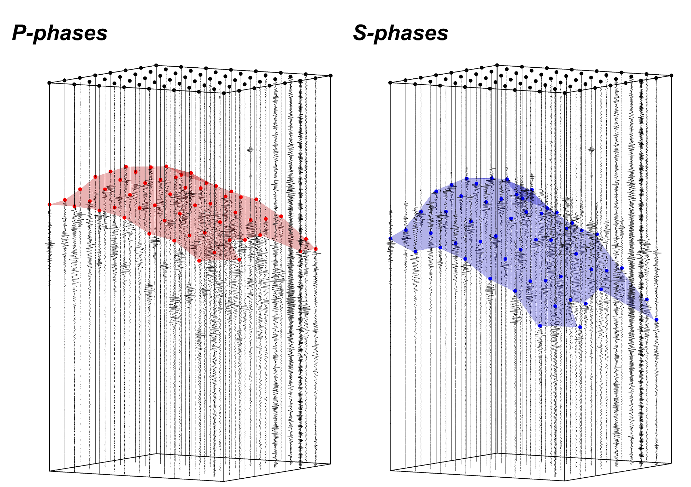

# CubeNet: Array-based Seismic Phase Picking with Deep Learning

A multi-trace seismic phase picking method for both P- and S- arrivals which is particularly suitable for dense array.



By Guoyi Chen @ USTC, Email: billychen@mail.ustc.edu.cn

## 1. Install (using conda)

```
conda create -n CubeNet python=3.6
conda activate CubeNet
pip install -r requirements.txt
```

## 2. Prediction

```python
import sys; sys.path.append('PATH'); # add the path of CubeNet package if necessary
picker = CubeNet.picker
picker.RegCube(sta) # Put the station locations in, shape: (Station number, 2), unit: km
_,pick_result,fs = picker.pick(data) # Put the raw data in, shape: (TraceID, Components, Sampling pts)
```

Three demos are prepared to give more details on prediction, which are located in directory: demo/

**Demo1**: Predict P/S arrival phases with given raw waveforms and station locations

**Demo2**: Direct Pick P/S arrivals from a given cube

**Demo3**: Usage of data resampling in CubeNet

## 3. Training

```python
import sys; sys.path.append('PATH'); # add the path of CubeNet package if necessary
import CubeNet
CubeNet.start_train(CubeNet.network,CubeNet.config.train_info)
```

Please set the training parameter before training by **config.py** in the CubeNet package

The demo data cubes for training are located in the directory of npz files: demo/demo_data

The npz file contains four variable: "waveform", "label", "label_mat", "fs"

**"waveform"**  and **"label"** have a shape of 3$\times$8$\times$8$\times$6000

**"label_mat"** are marks with a shape of 3$\times$8$\times$8 indicating that traces in the cubes are labeled (marked as True) or not (marked as False)

**"fs"** is the sampling rate of a cube.

## 4. Parameter Setup

Some parameters (like GPU acceleration) for prediction and training can be set by **config.py** in the CubeNet package.

A GPU with more than 4GB of memory is recommended to run CubeNet.

##  Citation

If you find CubeNet useful, please cite the following reference:

Guoyi Chen, Junlun Li; CubeNet: Array‐Based Seismic Phase Picking with Deep Learning. **Seismological Research Letters** 2022; doi: https://doi.org/10.1785/0220220147

## License

The **CubeNet** package is distributed under the `MIT license` (free software).